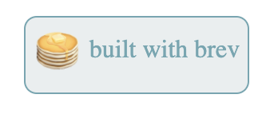

# built-with-brev

> Built with brev.dev badge

A simple badge showing your backend was built using Brev 🥞🚀




[](https://www.npmjs.com/package/built-with-brev) [](https://standardjs.com)

## Install

```bash
npm install --save built-with-brev
```

## Usage

```jsx
import React, { Component } from 'react'
import { BuiltWithBrev } from 'built-with-brev'

class Example extends Component {
  render() {
    return <BuiltWithBrev />
  }
}
```

## Not Using React?
If you're not using react, just copy this style tag in the `head` tag of your html file:
```html
<style>
    @font-face {
        font-family: "BalooMed";
        src: url("https://ad-aptive-images.s3-us-west-1.amazonaws.com/BalooTammudu2-Regular.ttf")
            format("truetype");
    }
</style>
```
And add the following div
```html
<div class="brevBadge" style="position: absolute; border-radius: 8px; background-color: #e9eeef; margin: 8px; height: 47px; max-width: 200px; border: 1px solid #6ca7b2; color: #6ca7b2; padding-right: 5px; font-family:'BalooMed'">
  <a href="https://brev.dev" target="_blank" rel="noreferrer" style="color: inherit; text-decoration: none;">
  <div class="brevBadgeContents" style="max-width: 100%; display: flex; flex-direction: row; justify-content: center; align-items: center; width: 100%;">
  <div class="imgWrapper" style="display: inline-block; overflow: hidden;">
  
  </div>
  <div class="brev-text" style="margin-top: -4px;">built with brev</div>
  </div>
  </a>
</div>
```

## What is Brev?
Brev is a developer environment that handles all of your infrastructure for you. Everything from configuring databases, deploying, hosting etc just happens for you so you can focus on your code. Check it out https://brev.dev

## License

MIT © [brevdev](https://github.com/brevdev)
